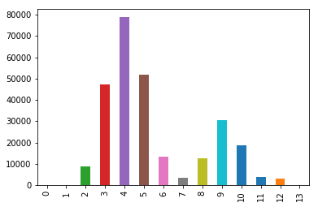
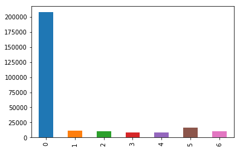

# VI13 - Information Visualization

Data visualization class at Instituto Superior de Técnico Lisbon.

## TODO - checkpoint 1
- [ ] Add other datasets (with links, and size)
- [ ] Change the current dataset to RAW version
- [ ] Print the new word doc again

## Dataset
- mapping of university code to city name - DONE
- distance between cities
- language family
- cost of living
- university rank
- state general information (size, number of people)

## Dataset Student_mobility (2009 - 2014)
RAW datasets are available at [data.europa.eu](https://data.europa.eu/euodp/en/data/dataset?q=Raw+data+of+Erasmus+student+mobility&ext_boolean=all&sort=). However only for the years 2009 - 2014. The latest 2013-14 dataset is available [here](https://data.europa.eu/euodp/en/data/dataset/erasmus-mobility-statistics-2013-14).

The 2013/2014 dataset consists of 272 497 records and contains the following columns:

``` text
Action, CallYear, ProjectNumber, MobiilityID, SendingCountry, ReceivingCountry, MobilityType, SpecialNeeds, SubjectAreaCode, SubjectAreaName, CombinedMobilityYesNo, StartDate, EndDate, DurationInMonths, DurationInDays, SubsistenceTravel, LevelOfStudy, ParticipantID, ParticipantGender, ParticipantType, Language, SendingPartnerErasmusID, SendingPartnerName, HostingPartnerErasmusID, HostingPartnerName, HostingPartnerCountry, HostingPartnerCity
```

Whole description of dataset and each attribute can be obtained from [European Open Data Portal](https://data.europa.eu/euodp/en/data/dataset/erasmus-mobility-statistics-2013-14/resource/ebf302e3-0300-48c4-a713-c795325e7034). The dataset contains an entry for each student participating in the Erasmus+ programme. Length of the stay can be calculated from *StartDate* and *EndDate* as well as *DurationInMonths* and *DurationInDays* columns. 

The dataset contains information about the sending and receiving institution (*SendingPartnerErasmusID, SendingPartnerName, HostingPartnerErasmusID, HostingPartnerName, HostingPartnerCountry, HostingPartnerCity*), the area of studies (*SubjectAreaCode, SubjectAreaName*), sending and receiving country code (*SendingCountry, ReceivingCountry*), information about the degree (*LevelOfStudy*) as well as participant's gender (*ParticipantGender*), language (*Language*) and identification whether the participant requires any special needs (*SpecialNeeds*). City of the sending institution is not available however should be obtainable from other dataset which maps the code to the institution.

### Dataset Sample

<!---
 Make sure that the index is not called Action. 
 The table was generated with https://www.tablesgenerator.com/markdown_tables.
 --->
| | Action | CallYear | ProjectNumber | MobiilityID | SendingCountry | ReceivingCountry | MobilityType | SpecialNeeds | SubjectAreaCode | SubjectAreaName | CombinedMobilityYesNo | StartDate | EndDate | DurationInMonths | DurationInDays | SubsistenceTravel | LevelOfStudy | ParticipantID | ParticipantGender | ParticipantType | Language | SendingPartnerErasmusID | SendingPartnerName | HostingPartnerErasmusID | HostingPartnerName | HostingPartnerCountry | HostingPartnerCity |
|--------|----------|---------------|------------------------|-----------------------|------------------|--------------|--------------|-----------------|-----------------|------------------------------------------------|-----------|----------------------|----------------------|----------------|-------------------|--------------|---------------|---------------------|-----------------|----------|-------------------------|--------------------|------------------------------------------------|--------------------|--------------------------------------------------|--------------------|-------------------------|
| 162835 | ERA02 | 2013 | 2013-1-GR1-ERA02-15244 | GRSMS13314752160 | GR | DE | Mob-SMS | 0.0 | 380 | Law | NO | 21-OCT-2013 00.00.00 | 02-AUG-2014 00.00.00 | 9 | 0 | 4037.5 | First Cycle |  | F | Students | DE | G  ATHINE01 | ETHNIKO KAI KAPODISTRIAKO PANEPISTIMIO ATHINON | D  FREIBUR01 | ALBERT-LUDWIGS-UNIVERSITÄT FREIBURG IM BREISGAU | DE | Freiburg |
| 146880 | ERA02 | 2013 | 2013-1-GB1-ERA02-24406 | 104 | GB | ES | Mob-SMP | 0.0 | 222 | Foreign languages |  | 01-OCT-2013 00.00.00 | 31-MAY-2014 00.00.00 | 8 | 0 | 3093.75 | First Cycle | UK1110643295271 | F | Students | ES | UK LEEDS02 | Leeds Metropolitan University |  | IES El Bohio | ES | Murcia |
| 88811 | ERA02 | 2013 | 2013-1-ES1-ERA02-74180 | 39464320TSMS | ES | LT | Mob-SMS | 0.0 | 481 | Computer science | NO | 01-SEP-2013 00.00.00 | 26-JUN-2014 00.00.00 | 9 | 0 | 1450.0 | First Cycle | 39464320T | M | Students | EN | E  VIGO01 | UNIVERSIDADE DE VIGO | LT VILNIUS10 | VILNIAUS KOLEGIJA | LT | Vilnius |
| 232503 | ERA02 | 2013 | 2013-1-PL1-ERA02-39278 | 39278-MOB-00009 | PL | PT | Mob-SMS | 0.0 | 340 | Business and administration (broad programmes) | NO | 28-AUG-2013 00.00.00 | 31-JAN-2014 00.00.00 | 5 | 0 | 1575.0 | Second Cycle |  | F | Students | EN | PL WARSZAW21 | Akademia Leona Koźmińskiego | P  LISBOA07 | ISCTE-INSTITUTO UNIVERSITÁRIO DE LISBOA | PT | LISBOA |
| 92053 | ERA02 | 2013 | 2013-1-ES1-ERA02-74197 | 74197-MOB-00071 | ES | PT | Mob-SMS | 0.0 | 14 | Teacher training and education science | NO | 21-AUG-2013 00.00.00 | 03-JUL-2014 00.00.00 | 10 | 0 | 1750.0 | First Cycle | 71306410Q | F | Students | PT | E  BURGOS01 | UNIVERSIDAD DE BURGOS | P  LEIRIA01 | INSTITUTO POLITÈCNICO DE LEIRIA (IPL) | PT | LEIRIA |
| 55489 | ERA02 | 2013 | 2013-1-DE1-ERA02-02508 | 23107 | DE | GB | Mob-SMS | 0.0 | 22 | Humanities | NO | 15-SEP-2013 00.00.00 | 06-JUN-2014 00.00.00 | 8 | 0 | 2520.0 | First Cycle | 17211 | F | Students | EN | D  LEIPZIG01 | Universität Leipzig | UK MANCHES01 | THE UNIVERSITY OF MANCHESTER | GB | MANCHESTER |
| 10505 | ERA02 | 2013 | 2013-1-BE3-ERA02-07678 | 214-2013-2014 | BE | IT | Mob-SMS | 0.0 | 225 | History and archeology | NO | 29-JAN-2014 00.00.00 | 18-JUN-2014 00.00.00 | 4 | 0 | 1850.0 | First Cycle |  | M | Students | IT | B  ANTWERP01 | UNIVERSITEIT ANTWERPEN | I  BOLOGNA01 | UNIVERSITÀ DI BOLOGNA - ALMA MATER STUDIORUM | IT | BOLOGNA |
| 170547 | ERA02 | 2013 | 2013-1-HU1-ERA02-10358 | 13/003-E-1013/SMS/212 | HU | IS | Mob-SMS | 0.0 | 312 | Sociology and cultural studies | NO | 03-JAN-2014 00.00.00 | 10-MAY-2014 00.00.00 | 4 | 0 | 1664.0 | Second Cycle | HU BUDAPES01 SM 193 | F | Students | EN | HU BUDAPES01 | Eötvös Loránd Tudományegyetem | IS REYKJAV01 | HASKOLI ISLANDS | IS | Reykjavik |
| 57082 | ERA02 | 2013 | 2013-1-DE1-ERA02-02527 | 02527-MOB-00009 | DE | GB | Mob-SMS | 0.0 | 214 | Design | NO | 16-SEP-2013 00.00.00 | 24-JAN-2014 00.00.00 | 4 | 0 | 1182.0 | First Cycle |  | F | Students | EN | D  MANNHEI03 | Hochschule Mannheim | UK LEEDS01 | UNIVERSITY OF LEEDS | GB | Leeds |
| 151116 | ERA02 | 2013 | 2013-1-GB1-ERA02-25231 | 25231-MOB-00018 | GB | FR | Mob-SMS | 0.0 | 380 | Law | NO | 28-AUG-2013 00.00.00 | 14-DEC-2013 00.00.00 | 3 | 0 | 1406.25 | First Cycle | UK1111682321277 | F | Students | FR | UK GLASGOW01 | University of Glasgow | F  MARSEIL84 | UNIVERSITE D'AIX-MARSEILLE | FR | AIX-EN-PROVENCE CEDEX 1 |

## Dataset EUC_for_academic (2007 - 2014)
This datasets consist of all universities participating in ERASMUS program for the specific academic year. Years 2007 - 2013 are in a dataset called EUC_Consolidated_Table_2007_2013, year 2013-2014 is in the dataset EUC_for_academic_year_2013_2014.

The 2007 - 2013 dataset consists of 4918 records and contains the following columns:

``` text
Country, Charter type code, Organisation Name, Erasmus code, Street, Postcode, City
```

The 2013/2014 dataset consists of 4919 records and contains the following columns:

``` text
Institutional code, Application Reference Number, Name of Organisation, Country, City, Code
```

The datasets can be used for mapping of university code to city name.

##Dataset Comparative_food_price
Whole dataset can be obtained from [Eurostat](
https://ec.europa.eu/eurostat/databrowser/view/tec00120/default/table?lang=en). Check the link to see barchart and map graphics.

This dataset contains comparative price levels if final consumption by private households. Comparative price levels are the ratio between Purchasing power partities (PPPs) and market exchange rate for each country. PPPs are currency conversion rates that convert economic indicators expressed in national currencies to a common currency, called Purchasing Power Standard (PPS). Because of this is allows meaningful comparison.

The ratio is shown in relation to the EU average which is 100. If the index of the country is higher/lower than 100, the country concerned is relatively expensive/cheap as compared to EU average.

##Dataset Food_price_monitoring_tool (2011-2018)
Want to use the beer column. The value used if Harmonised index of consumer prices. Have to find out if that is going to be correct.


## Data exploration

#### DurationInMonths and DurationInDays
Length of the stay during the mobility. First graph shows the length of stay in months and the second one length of stay in days.





